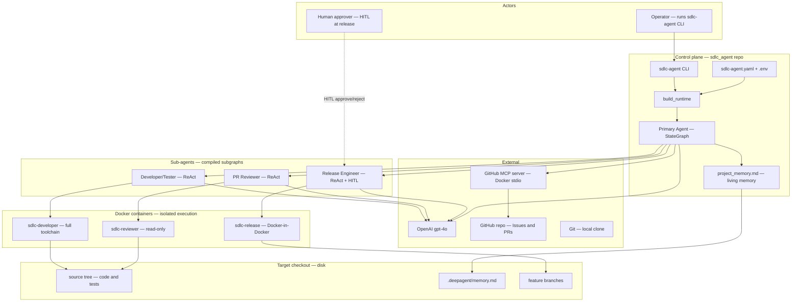
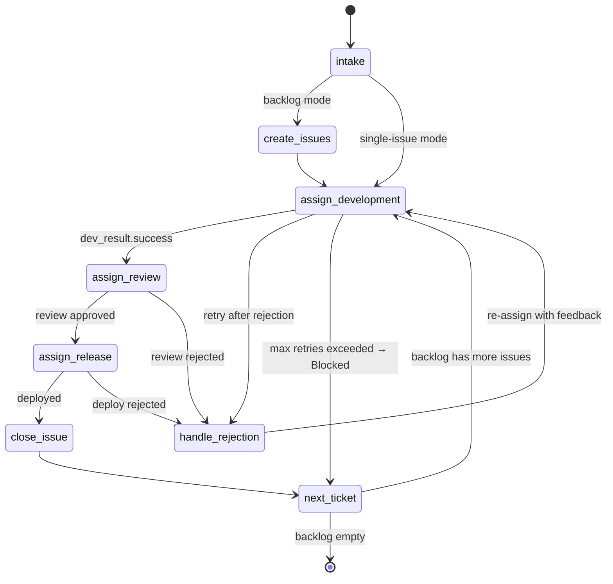
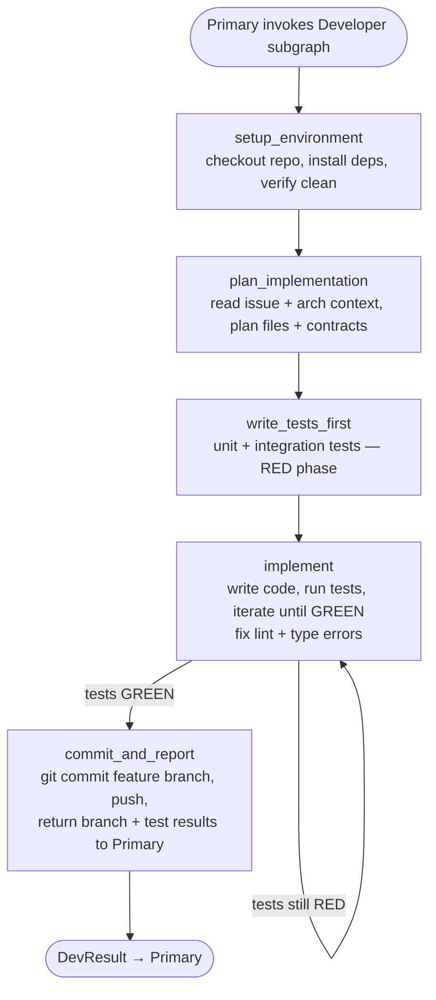
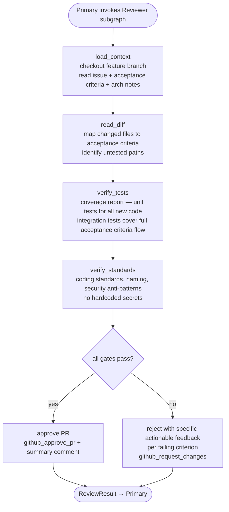
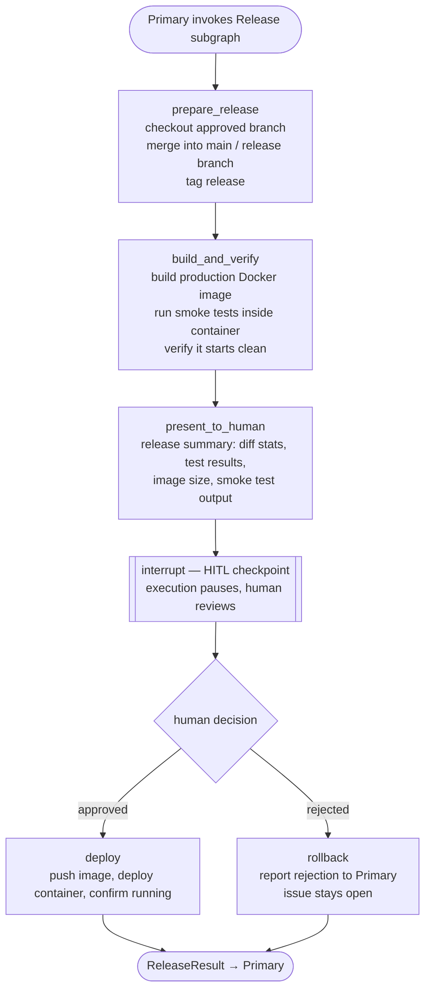
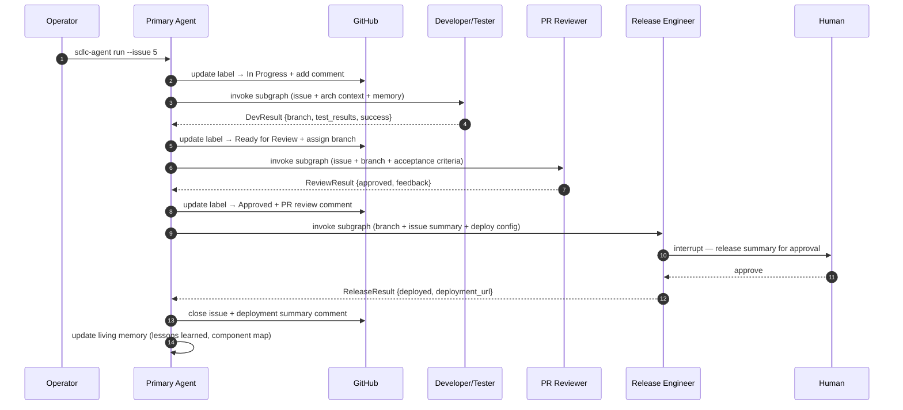
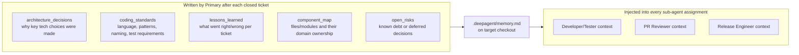
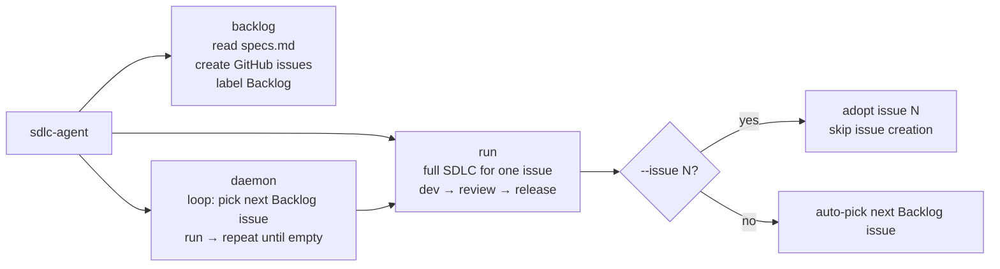
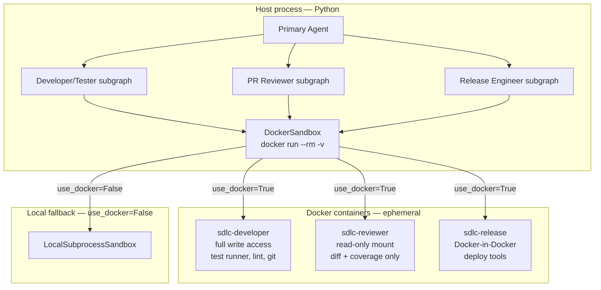
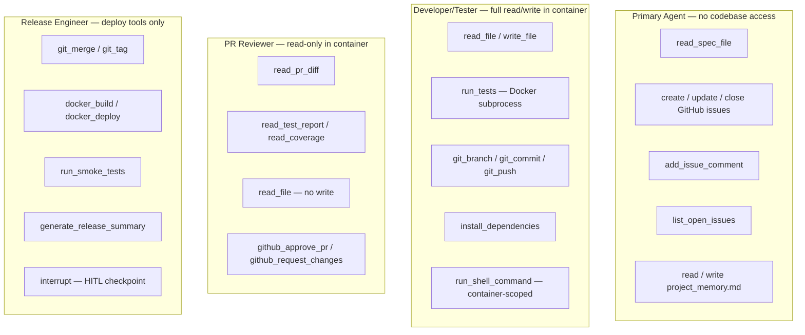

# System Design — SDLC Deep Agent v2

Visual companion to `ARCHITECTURE.md` and the design spec at `docs/superpowers/specs/2026-05-26-deep-agent-orchestrator-design.md`. All diagrams use [Mermaid](https://mermaid.js.org/).

---

## 1. System context (C4-style)

Two repositories matter: the **control plane** (`sdlc_agent` package + `sdlc-agent.yaml`) and the **target project** (checkout where code and `.deepagent/` live).

---

## 2. Primary agent — StateGraph nodes

---

## 3. Developer/Tester sub-agent — TDD loop

---

## 4. PR Reviewer sub-agent — review loop

---

## 5. Release Engineer sub-agent — deploy loop with HITL

---

## 6. Full issue lifecycle — sequence

---

## 7. Primary living memory — structure and lifecycle

---

## 8. CLI run modes

---

## 9. Docker execution model

---

## 10. Least privilege per agent

---

## Related reading

| Document | Purpose |
|---|---|
| `ARCHITECTURE.md` | Decision rationale and trade-offs |
| `README.md` | Setup, CLI, quick start |
| `docs/superpowers/specs/2026-05-26-deep-agent-orchestrator-design.md` | Full design specification |
