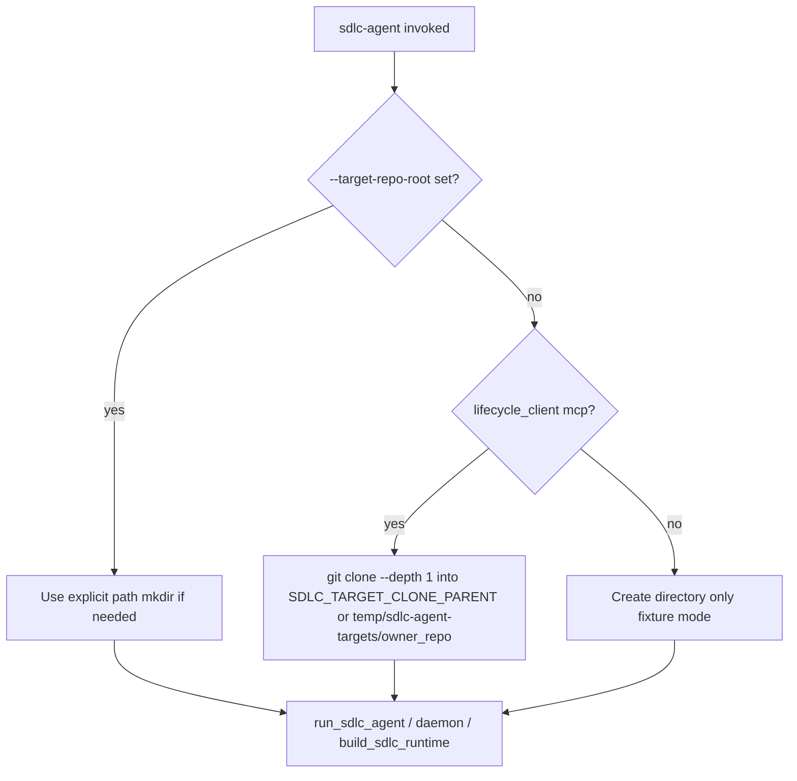
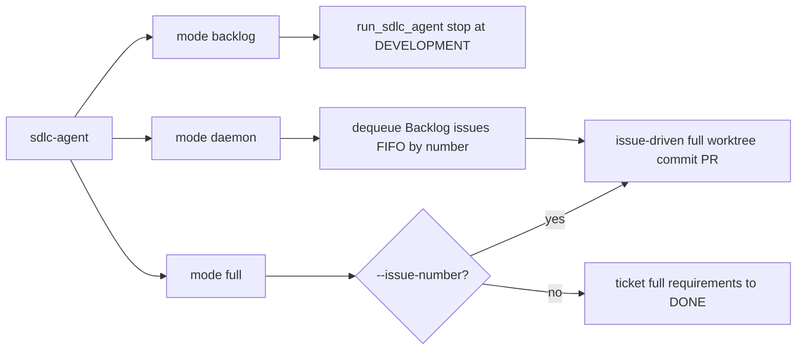
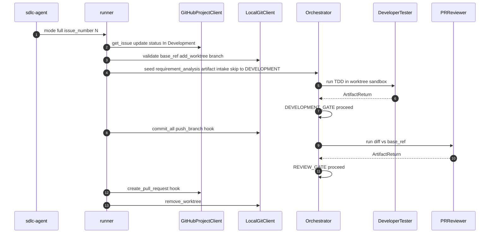
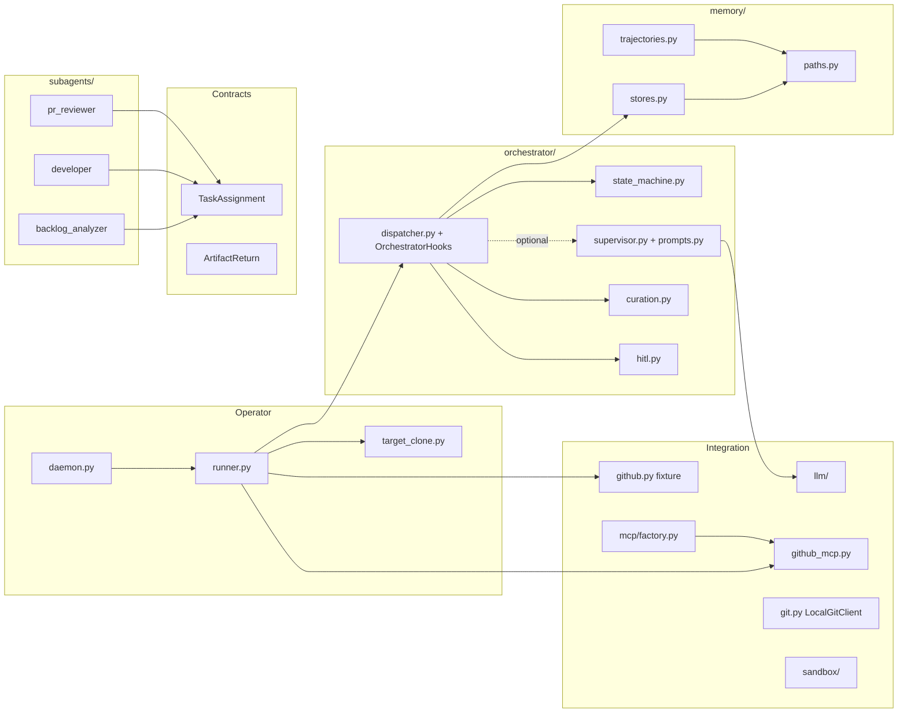
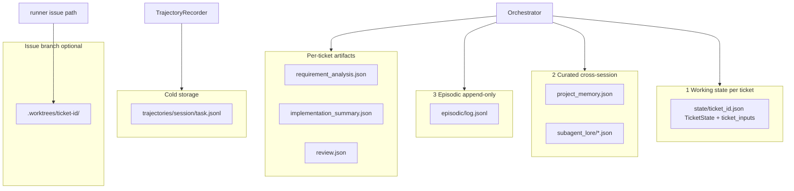
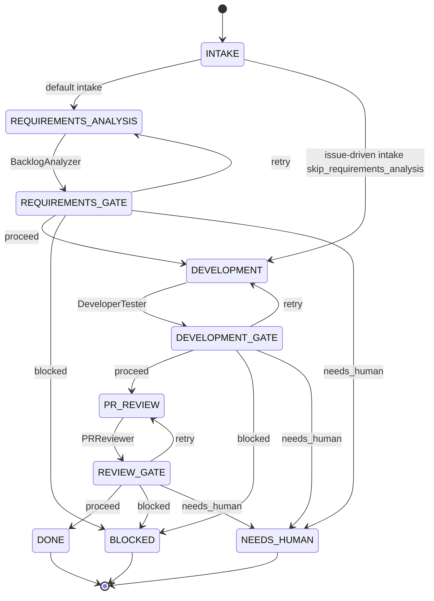
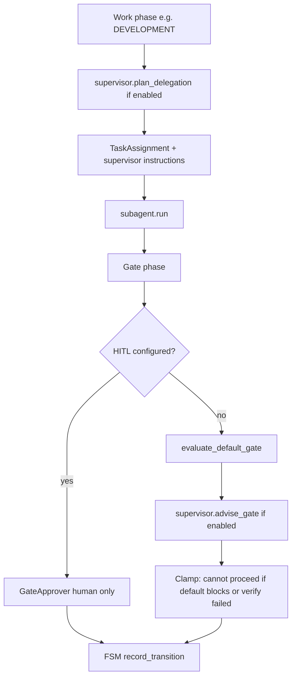
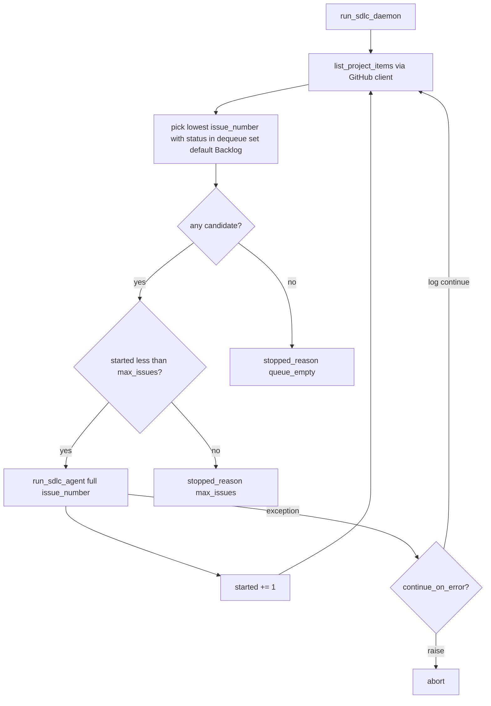
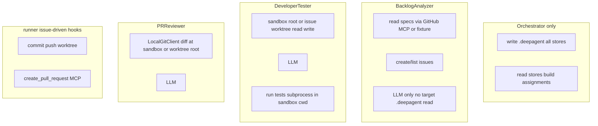
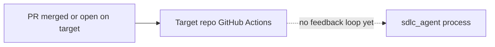

# System-level design diagrams

This document is a **visual companion** to `sdlc-deep-agent-spec.md` and `ARCHITECTURE.md`. Diagrams use [Mermaid](https://mermaid.js.org/); they render in GitHub, GitLab, many IDEs, and Cursor preview.

---

## 1. System context (C4-style)

Two repositories matter: the **control plane** (`sdlc_agent` package + `sdlc-agent.yaml`) and the **target project** (checkout where code and `.deepagent/` live).

```mermaid
flowchart TB
  subgraph Actors
    OP[Operator runs sdlc-agent CLI]
    HM[Human approver optional HITL]
  end

  subgraph External["External systems"]
    OAI[OpenAI Chat Completions API]
    GHMCP[GitHub MCP server Docker stdio]
    GH[GitHub repo Issues and PRs]
    GIT[Git local clone and worktrees]
  end

  subgraph Control["Control plane sdlc_agent repo"]
    CFG[sdlc-agent.yaml + .env secrets]
    CLI[sdlc-agent CLI]
    RUN[runner.py]
    DMN[daemon.py]
    RT[runtime.py build_sdlc_runtime]
  end

  subgraph Process["Orchestration in-process"]
    ORCH["Orchestrator dispatcher + FSM"]
    SUP["OrchestratorSupervisor LLM optional"]
    CG["CurationGate"]
    GA["GateApprover"]
    HOOKS["OrchestratorHooks commit push PR"]
    LOAD["SkillLoader skills/*.md"]

    subgraph Subagents["Subagents depth 1"]
      BA[BacklogAnalyzer]
      DV[DeveloperTester]
      PR[PRReviewer]
    end
    REG["Subagent registry"]
    ORCH --> REG
    ORCH -. plan + gate advice .-> SUP
    SUP --> OAI
    ORCH --> CG
    ORCH --> GA
    ORCH --> HOOKS
    REG --> BA
    REG --> DV
    REG --> PR
    LOAD -. system prompt .-> BA
    LOAD -. system prompt .-> DV
    LOAD -. system prompt .-> PR
    LOAD -. orchestrator-supervisor.md .-> SUP
  end

  subgraph TargetCheckout["Target checkout disk"]
    SRC[source tree specs.md code tests]
    WT[".worktrees/ticket-id issue branch"]
    DA[".deepagent state artifacts memory trajectories"]
  end

  OP --> CLI
  CLI --> RUN
  CLI --> DMN
  RUN --> RT
  DMN --> RUN
  RUN --> ORCH
  RT --> ORCH
  CFG --> RUN

  BA --> OAI
  BA --> GHMCP
  DV --> OAI
  PR --> OAI
  DV --> SBX["LocalSubprocessSandbox"]
  PR --> LGC["LocalGitClient"]
  RUN --> GHMCP
  RUN --> LGC
  HOOKS --> GHMCP
  HOOKS --> LGC

  GHMCP --> GH
  LGC --> GIT
  GIT --> TargetCheckout
  SBX --> WT
  LGC --> WT
  ORCH <--> DA
  CG <--> DA
  BA -. assignment only .-> DA
  DV -. assignment only .-> DA
  PR -. assignment only .-> DA
  HM -. GateApprover .-> GA
```

**Legend:** The operator runs the CLI from the control repo. The target checkout is either `--target-repo-root` or an auto-managed clone under `%TEMP%/sdlc-agent-targets/` (see `target_clone.py`). Subagents never read `.deepagent/` directly. When `orchestrator.use_llm_supervisor` is true, `OrchestratorSupervisor` plans delegation and advises gates; the FSM still applies safety clamps (see §7.1).

---

## 2. Target checkout resolution



`.deepagent/` is always written under this checkout root. Issue worktrees live under `<checkout>/.worktrees/<ticket-id>/` unless `--worktrees-dir` overrides the parent.

---

## 3. CLI run modes



| Mode | Stops / behavior |
|------|------------------|
| `backlog` | After first issue adopted; phase `DEVELOPMENT` |
| `full` + ticket | Full FSM on ticket; no auto commit/PR unless hooks added elsewhere |
| `full` + `--issue-number` | Skip requirements phase; worktree; commit/push; `create_pull_request` |
| `daemon` | Repeat issue-driven `full` until queue empty or `--max-issues` |

**Config (optional):** `orchestrator.use_llm_supervisor: true` in `sdlc-agent.yaml` enables the supervisor LLM (`model.roles.orchestrator`). Default is `false` (rules-only gates).

---

## 4. Issue-driven sequence (worktree → PR)



Hooks run only on **`PROCEED`** at the development and review gates when `issue_number` was set at intake.

---

## 5. Internal components and data ownership



**Import note:** `Orchestrator` is imported from `sdlc_agent.orchestrator.dispatcher` (not `orchestrator.__init__`) to avoid a circular import with `memory.stores`.

---

## 6. Memory layout (target checkout)



---

## 7. SDLC state machine (phases)

Standard path. Issue-driven intake can skip directly to `DEVELOPMENT` when `skip_requirements_analysis` is on `ticket_inputs`.



Gate decisions: `proceed`, `retry`, `blocked`, `needs_human` (`state_machine.py`). With the supervisor enabled, the LLM *recommends* a decision; `evaluate_default_gate` plus verification clamps still bound what the FSM can accept.

---

## 7.1 Supervisor LLM (hybrid orchestration)

When `orchestrator.use_llm_supervisor` is true, each work phase and gate consults `OrchestratorSupervisor` before the subagent runs and before the gate transition is recorded.



| Step | Owner | Notes |
|------|--------|--------|
| Phase transitions | FSM (`state_machine.py`) | Single source of truth for `current_phase` |
| Delegation text | Supervisor LLM | Scoped to ticket inputs, prior artifacts, retry guidance |
| Gate decision | Supervisor + rules | Cannot `proceed` if `verification.passed` is false or default would block |
| HITL | `GateApprover` | Supervisor skipped; human decides |
| Protocol | `skills/orchestrator-supervisor.md` | Loaded with `orchestrator/prompts.py` system prompt |

---

## 8. Daemon dequeue loop



Successful runs move issues out of **Backlog** via lifecycle label updates, so they are not picked again.

---

## 9. Least privilege: what each role touches



---

## 10. Promotion and CI (reference only)

The **sdlc_agent** repo may ship `.github/workflows/sdlc-promotion.yml` as a **template** for PR gates (`develop` → `release` → `main`). The agent does **not** install that workflow into the target repo automatically. When a PR exists on the target, GitHub Actions run according to **that** repo's workflows; the orchestrator does not wait for CI before dequeuing the next issue.



---

## Related reading

| Document | Use when |
|----------|----------|
| `sdlc-deep-agent-spec.md` | Full contracts, gates, build phases |
| `ARCHITECTURE.md` | Tradeoffs, control vs target, issue-driven path, deferrals |
| `README.md` | Setup, CLI examples, env vars |
